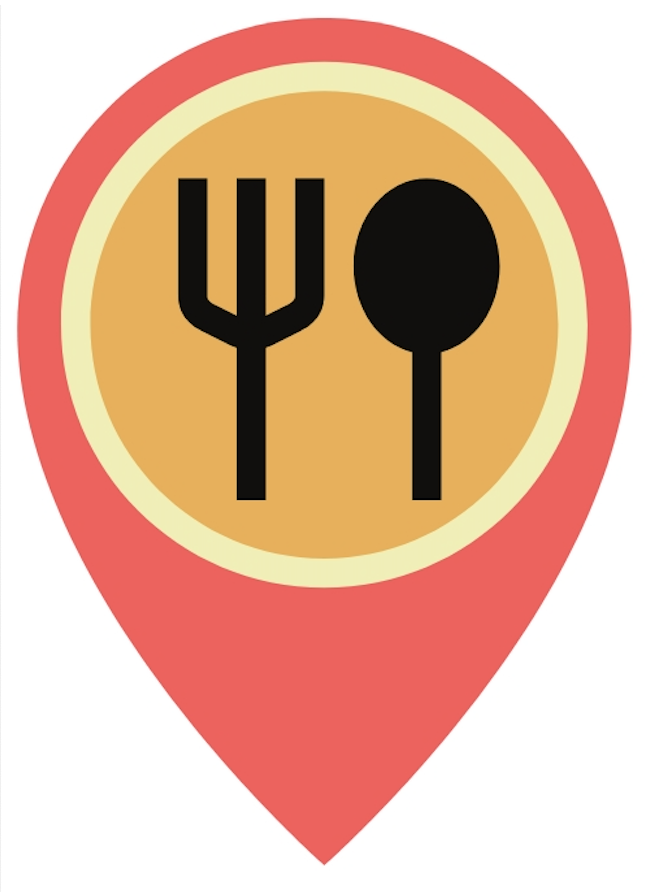

<!DOCTYPE html>
<html lang="vi">
<head>
<meta charset="utf-8"/>
<meta name="viewport" content="width=device-width, initial-scale=1.0"/>
<title>UEH Food Map — Mobile</title>

<!-- Fonts -->
<link href="https://fonts.googleapis.com/css2?family=Nunito:wght@400;700;900&family=Baloo+2:wght@700;800&display=swap" rel="stylesheet"/>

</head>
<body>

<!-- NAV -->
<nav class="nav">
  

    <a class="brand" href="#home">
      

      UEH Food Map
    </a>
    <button id="btnOpenAuth">Đăng nhập</button>

    

      

        <button class="tab" id="tabHomeBtn">Trang chủ ▾</button>
        

          <a href="#" data-cat="all">Tất cả</a>
          <a href="#" data-cat="com">Cơm</a>
          <a href="#" data-cat="bun">Bún/Mì/Phở</a>
          <a href="#" data-cat="fast">Đồ ăn nhanh</a>
          <a href="#" data-cat="other">Khác</a>
          <a href="#" data-cat="drink">Đồ uống</a>
        

      

      <a class="tab" href="#rank" id="tabRank">Ranking</a>
      <a class="tab" href="#map">Bản đồ</a>
      <a class="tab" href="#post" id="tabPost">Đăng tải</a>
      <a class="tab" href="#approve" id="tabApprove" style="display:none">Duyệt</a>
      <a class="tab" href="#chat">Chatbot</a>
    

  

</nav>

<!-- HOME -->
<section class="container" id="home">
  
<h1>Top quán ăn must try</h1>

  

    

      

      <button class="navbtn prev" id="heroPrev">◀</button>
      <button class="navbtn next" id="heroNext">▶</button>
      

    

    

      <svg class="icon" width="20" height="20" viewBox="0 0 24 24" fill="none"><circle cx="11" cy="11" r="7" stroke="currentColor" stroke-opacity=".8" stroke-width="2"/><path d="M20 20l-3.5-3.5" stroke="currentColor" stroke-opacity=".8" stroke-width="2" stroke-linecap="round"/></svg>
      <input id="search" type="text" placeholder="Tìm quán ăn, địa chỉ…"/>
    

    <!-- Cơ sở -->
    

    

    <button class="show-more" id="btnMore" hidden>Xem thêm</button>
  

</section>

<!-- RANK -->
<section class="container" id="rank" hidden>
  
<h1>Bảng Xếp Hạng Tuần</h1>

  

    

    

  

</section>

<!-- MAP -->
<section class="container" id="map" hidden>
  
<h1>Bản đồ tương tác</h1>

  

    

      

        
Bản đồ đang được phát triển…

        

          <button class="map-btn">📍 Khám phá ngay</button>
          <button class="map-btn">👉 Hướng dẫn</button>
        

      

    

    

      
🍱 Quán ăn  <b>50+</b>

      
☕ Quán cafe  <b>30+</b>

      
🍰 Tráng miệng  <b>20+</b>

    

    
💡 <b>Mẹo:</b> dùng bộ lọc để tìm theo khoảng cách, giá cả và loại món yêu thích nhé!

  

</section>

<!-- POST -->
<section class="container" id="post" hidden>
  
<h1>Đăng Tải Quán Ăn</h1>

  

    

      
<label>Tên quán ăn</label><input id="pName" placeholder="VD: Bún Bò Huế O Ty"/>

      
<label>Địa chỉ</label><input id="pAddr" placeholder="VD: 123 Nguyễn Tri Phương, P.5, Q.10"/>

      

        
<label>Giá từ (VND)</label><input id="pMin" type="number" min="0" placeholder="25000"/>

        
<label>đến (VND)</label><input id="pMax" type="number" min="0" placeholder="60000"/>

      

      
<label>Loại</label>
        <select id="pCat" style="height:42px;border:3px solid rgba(36,48,63,.18);border-radius:10px;padding:0 10px">
          <option value="com">Cơm</option><option value="bun">Bún/Mì/Phở</option><option value="fast">Đồ ăn nhanh</option><option value="other">Khác</option><option value="drink">Đồ uống</option>
        </select>
      

      <button class="show-more" id="btnSubmitPost" style="width:100%">Gửi Đề Xuất</button>
    

  

  

    <h3 style="margin:4px 0 10px">Lịch sử đề xuất</h3>
    
Bạn chưa có đề xuất nào.

  

</section>

<!-- APPROVE -->
<section class="container" id="approve" hidden>
  
<h1>Duyệt Đề Xuất</h1>

  
Chưa có đề xuất chờ duyệt.

</section>

<!-- CHAT -->
<section class="container" id="chat" hidden>
  
<h1>AI Chatbot</h1>

  

    
<b>UEH Food Bot</b> — Đang hoạt động ✨

    

    

      <button class="chip">🍜 Quán bún gần đây</button>
      <button class="chip">☕ Quán cafe yên tĩnh</button>
      <button class="chip">💸 Quán ăn giá rẻ</button>
      <button class="chip">🏆 Top quán ngon nhất</button>
    

    

      <input id="chatInput" placeholder="Bạn muốn ăn gì hôm nay?"/>
      <button class="chat-send" id="chatSend">Gửi</button>
    

  

</section>

<!-- DETAIL -->

  

    

      <strong id="dlgTitle">Chi tiết quán</strong>
      <button id="dlgClose" class="btn light">✕</button>
    

    

  

<!-- AUTH -->

  

    
<strong>Tài khoản</strong><button id="authClose" class="btn light">✕</button>

    

      

        
<label>Email</label><input type="email" id="loginEmail" placeholder="email@example.com">

        
<label>Mật khẩu</label><input type="password" id="loginPass" placeholder="••••••••">

        

          <button class="link" id="linkForgot" style="background:none;border:0;color:#1F3FAF;font-weight:900;cursor:pointer">Quên mật khẩu?</button>
          <button class="link" id="linkAdmin" style="background:none;border:0;color:#1F3FAF;font-weight:900;cursor:pointer">Quản trị viên?</button>
        

        
<button class="btn light" id="loginCancel">Huỷ</button><button class="btn primary" id="loginSubmit">Đăng nhập</button>

        

        
<button class="btn" id="btnCreate" style="background:#CFF6C9;border-color:rgba(36,48,63,.2)">Tạo tài khoản mới</button>

      

      

        
<label>Họ và tên</label><input type="text" id="suName" placeholder="Nguyễn Văn A">

        
<label>Email</label><input type="email" id="suEmail" placeholder="you@example.com">

        
<label>SĐT</label><input type="tel" id="suPhone" placeholder="09xx xxx xxx">

        
<label>Mật khẩu</label><input type="password" id="suPass" placeholder="••••••••">

        
<button class="btn light" id="signupCancel">Huỷ</button><button class="btn primary" id="signupSubmit">Đăng ký</button>

      

      

        
<label>Email</label><input type="email" id="rpEmail" placeholder="you@example.com">

        
<label>Mật khẩu mới</label><input type="password" id="rpPass1" placeholder="••••••••">

        
<label>Xác nhận mật khẩu mới</label><input type="password" id="rpPass2" placeholder="••••••••">

        
<button class="btn light" id="resetCancel">Huỷ</button><button class="btn primary" id="resetSubmit">Đặt lại mật khẩu</button>

      

    

  

<footer class="container">© 2025 UEH Food Map – mobile edition 🧃</footer>

<script>
/* Router */
const sections=['home','rank','map','post','approve','chat'];
function navigate(){const hash=(location.hash||'#home').replace('#','');sections.forEach(id=>document.getElementById(id).hidden=(id!==hash));document.querySelectorAll('.tabs .tab').forEach(t=>t.classList.remove('active'));if(hash==='home')document.getElementById('tabHomeBtn').classList.add('active');else document.querySelector(\`.tabs a[href="#\${hash}"]\`)?.classList.add('active');}
addEventListener('hashchange',navigate);navigate();

/* Data */
const DATA=[
  {id:1,slug:'bun-quay-tam-quan',name:'Bún Quậy TÂM QUÁN',addr:'210 Nguyễn Tri Phương',dist:'50m',price:'40-60k',rate:4.4,cat:'bun',campus:'B'},
  {id:2,slug:'rau-ma-mix',name:'Rau má mix',addr:'269 Nguyễn Tri Phương',dist:'60m',price:'12-34k',rate:4.2,cat:'drink',campus:'B'},
  {id:3,slug:'chicken-plus',name:'Chicken Plus',addr:'226 Nguyễn Tri Phương',dist:'120m',price:'100k/người',rate:4.2,cat:'fast',campus:'B'},
  {id:4,slug:'bun-thai',name:'Bún Thái',addr:'325 Nguyễn Tri Phương',dist:'350m',price:'29-59k',rate:4.9,cat:'bun',campus:'B'},
  {id:5,slug:'bun-bo-phuong-ngoc',name:'Bún bò Phương Ngọc',addr:'384 Hòa Hảo',dist:'160m',price:'38-48k',rate:4.5,cat:'bun',campus:'B'},
  {id:6,slug:'quan-chay-an-cat-tuong',name:'Quán chay An Cát Tường',addr:'218 Nguyễn Tri Phương',dist:'100m',price:'49-86k',rate:4.3,cat:'other',campus:'B'},
  {id:7,slug:'com-tom-phu-trung',name:'Cơm tôm phủ trứng',addr:'Đào Duy Từ',dist:'50m',price:'35-40k',rate:4.8,cat:'com',campus:'B'},
  {id:8,slug:'tra-sua-gia-nghi',name:'Trà Sữa Gia Nghi',addr:'415A Hòa Hảo',dist:'170m',price:'—',rate:5.0,cat:'drink',campus:'B'},
  {id:9,slug:'yi-jia-desert',name:'Yi Jia Desert',addr:'363 Vĩnh Viễn',dist:'450m',price:'25-48k',rate:4.3,cat:'other',campus:'B'},
  {id:10,slug:'tra-sua-tuyet-ngan',name:'Trà sữa Tuyết Ngân',addr:'208/20/8 Nguyễn Tri Phương',dist:'280m',price:'28-78k',rate:4.1,cat:'drink',campus:'B'},
  {id:11,slug:'bun-dau-mam-tom-tien-hai',name:'Bún đậu mắm tôm Tiến Hải',addr:'409 Nguyễn Tri Phương',dist:'450m',price:'22-100k',rate:4.1,cat:'bun',campus:'B'},
  {id:12,slug:'tra-sua-phuong-hoang',name:'Trà sữa Phượng Hoàng',addr:'317B Nguyễn Tri Phương',dist:'80m',price:'25-35k',rate:4.3,cat:'drink',campus:'B'},
  {id:13,slug:'ha-cao-phanh',name:'Há cảo Phánh',addr:'012 Lô B Chung cư Nguyễn Trãi',dist:'900m',price:'12-100k',rate:4.5,cat:'fast',campus:'B'},
  {id:14,slug:'com-ga-tam-ky',name:'Cơm gà Tam Kỳ',addr:'65 Đào Duy Từ',dist:'30m',price:'35-50k',rate:4.6,cat:'com',campus:'B'},
  {id:15,slug:'bun-thai-com-viet',name:'Bún thái - Cơm Việt',addr:'325 Nguyễn Tri Phương',dist:'70m',price:'30-35k',rate:4.4,cat:'bun',campus:'B'},
  {id:16,slug:'sinh-to-hem',name:'Sinh tố hẻm',addr:'394 Hoà Hảo',dist:'400m',price:'10-25k',rate:4.8,cat:'drink',campus:'B'},
  {id:17,slug:'bun-dau-non-la',name:'Bún đậu Nón Lá',addr:'188 Nguyễn Tri Phương',dist:'70m',price:'40-70k',rate:4.6,cat:'bun',campus:'B'}
];
const imgOf=s=>`${s}.jpg`;

/* Load reviews.json if có (GH Pages), fallback inline */
let REVIEWS = {};
(function(){
  function tryInline(){const el=document.getElementById('reviewsInline');if(el){try{REVIEWS=JSON.parse(el.textContent||'{}')}catch(e){}}}
  fetch('reviews.json',{cache:'no-store'})
    .then(r=>r.ok?r.json():Promise.reject())
    .then(j=>REVIEWS=j||{})
    .catch(()=>tryInline());
})();

/* Hero */
const TOP5=[...DATA].sort((a,b)=>b.rate-a.rate).slice(0,5);
const heroTrack=document.getElementById('heroTrack'),heroPager=document.getElementById('heroPager');
TOP5.forEach((x,i)=>{heroTrack.insertAdjacentHTML('beforeend',`

${x.name}

`);heroPager.insertAdjacentHTML('beforeend',`<button class="dot${i?'':' active'}" data-idx="${i}"></button>`);});
let heroIdx=0;function updateHero(){heroTrack.style.transform=`translateX(-${heroIdx*100}%)`;document.querySelectorAll('.dot').forEach((d,i)=>d.classList.toggle('active',i===heroIdx));}
document.getElementById('heroPrev').onclick=()=>{heroIdx=(heroIdx+TOP5.length-1)%TOP5.length;updateHero();}
document.getElementById('heroNext').onclick=()=>{heroIdx=(heroIdx+1)%TOP5.length;updateHero();}
setInterval(()=>{heroIdx=(heroIdx+1)%TOP5.length;updateHero();},5000);
heroPager.addEventListener('click',e=>{const b=e.target.closest('.dot');if(!b)return;heroIdx=+b.dataset.idx;updateHero();});
// Swipe
(function(){const el=document.querySelector('.hero-viewport');if(!el)return;let startX=0,dx=0,swiping=false;const onStart=e=>{swiping=true;startX=(e.touches?e.touches[0].clientX:e.clientX);dx=0};const onMove=e=>{if(!swiping)return;const x=(e.touches?e.touches[0].clientX:e.clientX);dx=x-startX};const onEnd=()=>{if(!swiping)return;swiping=false;if(Math.abs(dx)>50){heroIdx=(heroIdx+(dx<0?1:(TOP5.length-1)))%TOP5.length;updateHero();}};el.addEventListener('touchstart',onStart,{passive:true});el.addEventListener('touchmove',onMove,{passive:true});el.addEventListener('touchend',onEnd,{passive:true});el.addEventListener('mousedown',onStart);window.addEventListener('mouseup',onEnd);window.addEventListener('mousemove',onMove);})();

/* Grid + Search + Campus */
const grid=document.getElementById('cards'),btnMore=document.getElementById('btnMore');let currentCat='all',searchQuery='',expanded=false;
const CAMPUSES=[{code:'B',label:'CS B'},{code:'A',label:'CS A'},{code:'C',label:'CS C'},{code:'D',label:'CS D'},{code:'E',label:'CS E'},{code:'H',label:'CS H'},{code:'I',label:'CS I'}];
let activeCampus='B';
const campusRow=document.getElementById('campusRow');
function renderCampusPills(){campusRow.innerHTML='';CAMPUSES.forEach(c=>{campusRow.insertAdjacentHTML('beforeend',`<button class="camp-pill ${activeCampus===c.code?'active':''}" data-code="${c.code}">${c.label}</button>`);});}
renderCampusPills();
campusRow.addEventListener('click',e=>{const b=e.target.closest('.camp-pill');if(!b)return;activeCampus=b.dataset.code;expanded=false;renderCampusPills();renderGrid();});

function formatCard(it){const price=it.price?.trim()?it.price:'—';return `<article class="card" data-id="${it.id}">
★ ${it.rate}
${it.dist}${price}

${it.name}

${it.addr}

</article>`;}
function renderGrid(){
  const list=DATA.filter(x=>(x.campus===activeCampus)&&(currentCat==='all'||x.cat===currentCat)&&((x.name+' '+x.addr).toLowerCase().includes(searchQuery)));
  grid.innerHTML='';
  list.forEach((it,idx)=>{grid.insertAdjacentHTML('beforeend',formatCard(it));if(!expanded&&idx>=8)grid.lastElementChild.classList.add('hidden');});
  btnMore.hidden=list.length<=8;btnMore.textContent=expanded?'Thu gọn':'Xem thêm';
}
btnMore.onclick=()=>{expanded=!expanded;grid.querySelectorAll('.card').forEach((c,i)=>c.classList.toggle('hidden',!expanded&&i>=8));btnMore.textContent=expanded?'Thu gọn':'Xem thêm';if(!expanded)scrollTo({top:document.getElementById('home').offsetTop-60,behavior:'smooth'})};
const searchInput=document.getElementById('search');let t=null;searchInput.addEventListener('input',()=>{clearTimeout(t);t=setTimeout(()=>{searchQuery=searchInput.value.trim().toLowerCase();expanded=false;renderGrid();},150);});
renderGrid();
/* home dropdown */
const tabHomeBtn=document.getElementById('tabHomeBtn'),homeMenu=document.getElementById('homeMenu');
tabHomeBtn.addEventListener('click',(e)=>{e.stopPropagation();if(location.hash!=='#home')location.hash='#home';homeMenu.classList.toggle('open');});
homeMenu.querySelectorAll('a').forEach(a=>a.addEventListener('click',e=>{e.preventDefault();currentCat=a.dataset.cat||'all';expanded=false;homeMenu.classList.remove('open');renderGrid();}));
document.addEventListener('click',()=>homeMenu.classList.remove('open'));

/* Detail (rating cũng mở) + Tabs Menu/Tổng quan/Đánh giá */
const modal=document.getElementById('modal'),dlgContent=document.getElementById('dlgContent'),dlgTitle=document.getElementById('dlgTitle');
function closeModal(){modal.classList.remove('show');modal.style.display='none';}
document.getElementById('dlgClose').onclick=closeModal;
function openDetail(r){
  modal.style.display='flex';
  dlgTitle.textContent=r.name;
  dlgContent.innerHTML=`
    
    

      
${r.name}

      
${r.addr}

      
<strong>Giá:</strong> ${r.price||'—'}

      
<strong>Khoảng cách:</strong> ${r.dist}

      
<strong>Đánh giá:</strong> ★ ${r.rate}

    

    

      <button class="dlg-tab active" data-pane="menu">📖 Menu</button>
      <button class="dlg-tab" data-pane="overview">📋 Tổng quan</button>
      <button class="dlg-tab" data-pane="rate">⭐ Đánh giá</button>
    

    

      

        

          
          
        

        
Menu tham khảo

      

      

        

          
          
          
          
        

        

      

      

        

      

    

  `;

  const tabs=dlgContent.querySelectorAll('.dlg-tab');
  const panes=dlgContent.querySelectorAll('.dlg-pane');
  tabs.forEach(btn=>{
    btn.addEventListener('click',()=>{
      tabs.forEach(b=>b.classList.remove('active'));
      panes.forEach(p=>p.classList.remove('active'));
      btn.classList.add('active');
      dlgContent.querySelector(\`.dlg-pane[data-pane="\${btn.dataset.pane}"]\`).classList.add('active');
      if(btn.dataset.pane==='overview') renderReviewsFor(r.slug);
      else if(btn.dataset.pane==='rate') renderReviewForm(r.slug);
    });
  });

  renderReviewsFor(r.slug); // pre-fill Tổng quan
}
grid.addEventListener('click',e=>{const card=e.target.closest('.card');if(!card)return;const r=DATA.find(x=>x.id==card.dataset.id);if(r)openDetail(r);});
grid.addEventListener('click',e=>{if(e.target.closest('.rating')){const card=e.target.closest('.card');const r=DATA.find(x=>x.id==card.dataset.id);if(r)openDetail(r);}});

function renderReviewsFor(slug){
  const box=document.getElementById('revBox');
  const arr=(REVIEWS&&REVIEWS[slug])?REVIEWS[slug]:[];
  if(!box) return;
  box.innerHTML = arr.length ? arr.map(t=>`
${t}
`).join('') : `
Chưa có thông tin.
`;
}
function renderReviewForm(slug){
  const box=document.getElementById('revAction'); if(!box) return;
  if(sessionStorage.getItem('logged')==='1'){
    box.innerHTML = \`
      <textarea id="reviewInput" rows="3" style="width:100%;border-radius:8px;border:2px solid #eee;padding:8px;resize:vertical" placeholder="Chia sẻ cảm nhận của bạn về quán…"></textarea>
      <button id="reviewSubmit" class="btn primary" style="margin-top:8px">Gửi đánh giá</button>\`;
    box.querySelector('#reviewSubmit').onclick=()=>{
      const v=box.querySelector('#reviewInput').value.trim();
      if(!v){alert('Vui lòng nhập nội dung đánh giá!');return;}
      if(!REVIEWS[slug]) REVIEWS[slug]=[];
      REVIEWS[slug].push(v);
      alert('Đã gửi đánh giá!');
      box.querySelector('#reviewInput').value='';
      renderReviewsFor(slug);
    };
  }else{
    box.innerHTML=\`
      Vui lòng <button id="goLogin" style="background:none;border:0;color:#1F3FAF;font-weight:900;cursor:pointer;text-decoration:underline">đăng nhập</button> để gửi đánh giá.\`;
    box.querySelector('#goLogin').onclick=()=>{try{document.getElementById('dlgClose').click();}catch(e){};openAuth();};
  }
}

/* Ranking */
const rankPodium=document.getElementById('rankPodium'),rankRoll=document.getElementById('rankRoll');
function renderRank(){const top=[...DATA].sort((a,b)=>b.rate-a.rate).slice(0,5);const podium=[top[1],top[0],top[2]].filter(Boolean);rankPodium.innerHTML='';podium.forEach((r,i)=>{rankPodium.insertAdjacentHTML('beforeend',\`

#\${i===1?'1':(i===0?'2':'3')}

\${r.name}

⭐ \${r.rate}

\`);});rankRoll.innerHTML='';top.slice(3).forEach((r,i)=>{rankRoll.insertAdjacentHTML('beforeend',\`

#\${i+4}

\${r.name}

\${r.addr}

⭐ \${r.rate}

\`);});}
renderRank();
rankPodium.addEventListener('click',e=>{const tile=e.target.closest('.p-tile');if(!tile)return;const r=DATA.find(x=>x.id==tile.dataset.id);if(r)openDetail(r);});
rankRoll.addEventListener('click',e=>{const item=e.target.closest('.r-item');if(!item)return;const r=DATA.find(x=>x.id==item.dataset.id);if(r)openDetail(r);});

/* Post/Duyệt */
const SUB_KEY='uehSubmissions';const readSubs=()=>JSON.parse(localStorage.getItem(SUB_KEY)||'[]');const writeSubs=arr=>localStorage.setItem(SUB_KEY,JSON.stringify(arr));const historyBox=document.getElementById('historyBox');function nfmt(n){return(+n||0).toLocaleString('vi-VN');}
function renderHistory(){const list=readSubs().filter(s=>s.owner===sessionStorage.getItem('email'));historyBox.innerHTML=list.length?list.map(s=>`
<b>${s.name}</b> – ${s.addr} Giá: ${nfmt(s.min)} - ${nfmt(s.max)} VND · Loại: ${s.cat.toUpperCase()} · <i>${s.status}</i>
`).join(''):'Bạn chưa có đề xuất nào.'}
document.getElementById('btnSubmitPost').onclick=()=>{const name=document.getElementById('pName').value.trim();const addr=document.getElementById('pAddr').value.trim();const min=document.getElementById('pMin').value.trim();const max=document.getElementById('pMax').value.trim();const cat=document.getElementById('pCat').value;if(!name||!addr||!min||!max){alert('Điền đủ Tên/Địa chỉ/Giá.');return;}const subs=readSubs();subs.push({id:Date.now(),owner:sessionStorage.getItem('email'),name,addr,min,max,cat,status:'chờ duyệt'});writeSubs(subs);renderHistory();if(typeof renderApprove==='function') renderApprove();alert('Đã gửi đề xuất!');};
const approveList=document.getElementById('approveList');function renderApprove(){const arr=readSubs();approveList.innerHTML=arr.length?arr.map(s=>`

<b>${s.name}</b> – ${s.addr} Giá: ${nfmt(s.min)} - ${nfmt(s.max)} VND · Loại: ${s.cat.toUpperCase()} · <i>${s.status}</i>
<button class="btn primary" data-act="ok" data-id="${s.id}">Duyệt</button><button class="btn light" data-act="no" data-id="${s.id}">Từ chối</button>
`).join(''):'Chưa có đề xuất chờ duyệt.'}
approveList.addEventListener('click',e=>{const btn=e.target.closest('button');if(!btn)return;const id=+btn.dataset.id;const act=btn.dataset.act;const arr=readSubs();const it=arr.find(x=>x.id===id);if(!it)return;it.status=(act==='ok')?'đã duyệt':'từ chối';writeSubs(arr);renderApprove();if(act==='ok'){DATA.push({id:DATA.length+1,slug:'custom',name:it.name,addr:it.addr,dist:'—',price:`${nfmt(it.min)}-${nfmt(it.max)} VND`,rate:4.3,cat:it.cat,campus:'B'});renderGrid();renderRank();}});

/* Auth */
const auth=document.getElementById('auth'),btnOpenAuth=document.getElementById('btnOpenAuth');const authClose=document.getElementById('authClose'),loginCancel=document.getElementById('loginCancel')||{onclick:null};
function openAuth(){auth.classList.add('show');auth.style.display='flex'}
function forceCloseAuth(){auth.classList.remove('show');auth.style.display='none'}
[authClose,loginCancel].forEach(b=>b&&(b.onclick=forceCloseAuth));
window.addEventListener('load',()=>{updateNavbarByRole();if(sessionStorage.getItem('logged')==='1'){}else{openAuth();}});
btnOpenAuth.onclick=()=>{
  if(sessionStorage.getItem('logged')==='1'){
    sessionStorage.clear();
    updateNavbarByRole();
    location.hash='#home';
    forceCloseAuth();
  }else openAuth();
};
document.getElementById('loginSubmit').onclick=()=>{
  sessionStorage.setItem('logged','1');
  if(!sessionStorage.getItem('role')) sessionStorage.setItem('role','user');
  sessionStorage.setItem('email',document.getElementById('loginEmail').value.trim()||'user@example.com');
  updateNavbarByRole();
  alert('Đăng nhập thành công!');
  forceCloseAuth();
  location.hash='#home';
  renderHistory();
};
function updateNavbarByRole(){const role=sessionStorage.getItem('role');const logged=sessionStorage.getItem('logged')==='1';document.getElementById('tabPost').style.display= logged && role!=='admin' ? '' : 'none';document.getElementById('tabApprove').style.display= logged && role==='admin' ? '' : 'none';btnOpenAuth.textContent= logged ? 'Đăng xuất' : 'Đăng nhập';}

// Helpers
const linkForgot=document.getElementById('linkForgot');const linkAdmin=document.getElementById('linkAdmin');const btnCreate=document.getElementById('btnCreate');
linkForgot.onclick=()=>showAuthPane('reset');
linkAdmin.onclick=()=>{
  const code=prompt('Nhập mã quản trị viên:');
  if(code && code.trim()==='000'){
    sessionStorage.setItem('role','admin');
    sessionStorage.setItem('logged','1');
    updateNavbarByRole();
    alert('Kích hoạt chế độ Quản trị viên!');
    forceCloseAuth();
  } else if(code!==null) alert('Mã không hợp lệ!');
};
btnCreate.onclick=()=>showAuthPane('signup');
function showAuthPane(which){
  const loginPane=document.getElementById('paneLogin');
  const signupPane=document.getElementById('paneSignup');
  const resetPane=document.getElementById('paneReset');
  if(!loginPane||!signupPane||!resetPane) return;
  loginPane.style.display='none'; signupPane.style.display='none'; resetPane.style.display='none';
  if(which==='signup') signupPane.style.display='block'; else if(which==='reset') resetPane.style.display='block'; else loginPane.style.display='block';
  openAuth();
}
const signupCancel=document.getElementById('signupCancel')||{onclick:null};
if(signupCancel) signupCancel.onclick=()=>showAuthPane('login');
const signupSubmit=document.getElementById('signupSubmit')||{onclick:null};
if(signupSubmit) signupSubmit.onclick=()=>{
  const name=document.getElementById('suName').value.trim();
  const email=document.getElementById('suEmail').value.trim();
  const phone=document.getElementById('suPhone').value.trim();
  const pass=document.getElementById('suPass').value.trim();
  if(!name||!email||!phone||!pass){alert('Vui lòng điền đầy đủ Họ tên / Email / SĐT / Mật khẩu');return;}
  alert('Tạo tài khoản thành công! Vui lòng đăng nhập để tiếp tục.');
  showAuthPane('login'); const le=document.getElementById('loginEmail'); if(le) le.value=email;
};
const resetCancel=document.getElementById('resetCancel')||{onclick:null};
if(resetCancel) resetCancel.onclick=()=>showAuthPane('login');
const resetSubmit=document.getElementById('resetSubmit')||{onclick:null};
if(resetSubmit) resetSubmit.onclick=()=>{
  const email=document.getElementById('rpEmail').value.trim();
  const p1=document.getElementById('rpPass1').value.trim();
  const p2=document.getElementById('rpPass2').value.trim();
  if(!email||!p1||!p2){ alert('Vui lòng nhập đầy đủ Email / Mật khẩu mới / Xác nhận mật khẩu mới'); return; }
  if(p1!==p2){ alert('Mật khẩu xác nhận không khớp'); return; }
  alert('Đặt lại mật khẩu thành công! Vui lòng đăng nhập để tiếp tục.');
  showAuthPane('login'); const le=document.getElementById('loginEmail'); if(le) le.value=email;
};

/* Chat */
const chatLog=document.getElementById('chatLog'),chatInput=document.getElementById('chatInput'),chatSend=document.getElementById('chatSend');
function pushMsg(who,text){const w=document.createElement('div');w.className='msg'+(who==='you'?' me':'');w.innerHTML=text;chatLog.appendChild(w);chatLog.scrollTop=chatLog.scrollHeight;}
pushMsg('bot','Xin chào! Mình là AI Chatbot của UEH Food Map 🤖✨ Bạn muốn tìm món gì hôm nay? <i>Hãy nói: phở/cơm/đồ uống… hoặc “rẻ”, “gần”.</i>');
function handleChat(m){
  m=(m||'').toLowerCase();let cat=null;
  if (/(phở|bún|mì|miến|hủ tiếu|bun|pho)/.test(m)) cat='bun';
  else if (/(cơm|com)/.test(m)) cat='com';
  else if (/(trà sữa|tea|drink|nước|đồ uống|cafe|cà phê|coffee)/.test(m)) cat='drink';
  else if (/(chay|vegan)/.test(m)) cat='other';
  else if (/(gà rán|hamburger|pizza|fast)/.test(m)) cat='fast';
  const wantNear=/(gần|gần đây|đi bộ|bao xa|near)/.test(m);
  const wantCheap=/(rẻ|tiết kiệm|giá thấp|cheap)/.test(m);
  const wantTop=/(top|ngon nhất|best)/.test(m);
  let list=[...DATA].filter(x=>x.campus===activeCampus);
  if(cat) list=list.filter(x=>x.cat===cat);
  if(wantCheap){list=list.filter(x=>{const first=(x.price||'').toString().toLowerCase().replace(/[^0-9\-]/g,'').split('-')[0];const v=+first||0;return v&&v<=35000;});}
  if(wantNear) list.sort((a,b)=>parseInt(a.dist)-parseInt(b.dist)); else list.sort((a,b)=>b.rate-a.rate);
  list=list.slice(0,3);
  if(!list.length) return 'Chưa có gợi ý phù hợp :(';
  let header='Gợi ý nè';
  if(wantTop&&!wantNear&&!wantCheap) header='Top quán ngon nhất';
  else if(wantNear&&cat) header=`Gần đây (${cat})`; else if(wantNear) header='Gần đây';
  else if(wantCheap&&cat) header=`Giá rẻ (${cat})`; else if(wantCheap) header='Giá rẻ nè';
  else if(cat) header='Gợi ý theo loại';
  return header+': '+list.map(x=>`<b>${x.name}</b> (${x.addr}, ★${x.rate}${x.dist?`, ${x.dist}`:''})`).join(' · ');
}
let _chatBusy=false;
function sendChat(){if
